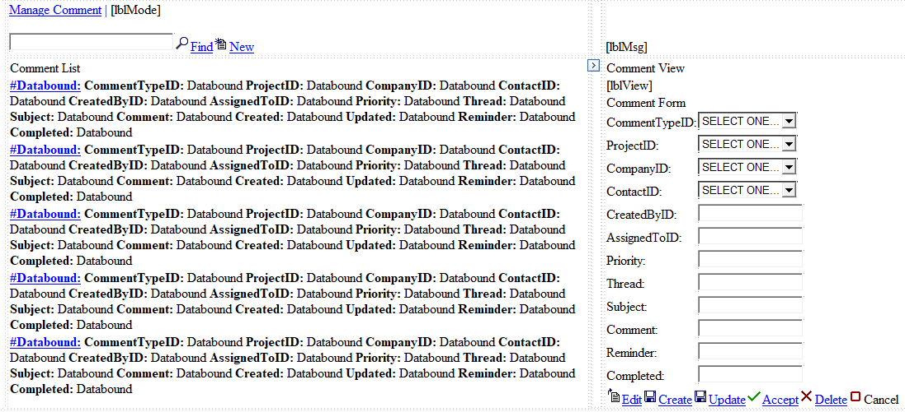

# DesignedNet `.NET Framework, C#, SQL, ASP.NET`
## Microsoft .NET v2.0 Code Generation Framework

### The DesignedNet Framework reduces development effort with automated code generation

DesignedNet is an application framework and code generation engine built using the Microsoft .NET Framework. This framework has been optimized to provide high performance and scalability for enterprise level software applications based on ASP.NET and Windows technologies. This framework has been leveraged on numerous projects for clients in a variety of industries with great success to deliver quality solutions in limited time and and on budget.

The ability to generate this amount of code substantially reduces the number of bugs due to the reuse of tested and proven base classes and the automation of the tedious operations of matching table and column names with display controls and user input validation. Examples of implementations of this framework are documented below for your review.

## Documentation

[Detailed Requirments](./Documentation/Requirements.pdf)

[Layer Specifications](./Documentation/Specifications.pdf)

## Code Examples

A Comments entity for a CRM system with Projects, Companines and Contacts

[Business Entity](./Output/Biz/BizComment.cs)

[Data Access Layer](./Output/Dal/DalComment.cs)

[SQL CRUD Procedures](./Output/Sql/Comment_Verbs.sql)

## User Interface

ASPX pages and ASXC controls were created for each database entity to enable simple CRUD access with foreign key navigation and user input validation.

### [Manage Comments Page Source](./Output/Web/ManageComment.aspx.cs)



### [Edit Comment Control Logic](./Output/Web/Controls/CommentEdit.ascx.cs)

**Edit Form HTML Example**
```html
<table class="form" border="0" cellpadding="1" cellspacing="0">
   <tr>
      <td colspan="2" class="header">
         <asp:Label ID="lblTitle" Runat="server">Comment Form</asp:Label>
      </td>
   </tr>
   <tr>
      <td class="field">CommentTypeID:</td>
      <td>
         <asp:DropDownList ID="selCommentTypeID" Runat="server" CssClass="select">
            <asp:ListItem Value="">SELECT ONE...</asp:ListItem>
         </asp:DropDownList>
      </td>
   </tr>
   <tr>
      <td class="field">ProjectID:</td>
      <td>
         <asp:DropDownList ID="selProjectID" Runat="server" CssClass="select">
            <asp:ListItem Value="">SELECT ONE...</asp:ListItem>
         </asp:DropDownList>
      </td>
   </tr>
   <tr>
      <td class="field">CompanyID:</td>
      <td>
         <asp:DropDownList ID="selCompanyID" Runat="server" CssClass="select">
            <asp:ListItem Value="">SELECT ONE...</asp:ListItem>
         </asp:DropDownList>
      </td>
   </tr>
   <tr>
      <td class="field">ContactID:</td>
      <td>
         <asp:DropDownList ID="selContactID" Runat="server" CssClass="select">
            <asp:ListItem Value="">SELECT ONE...</asp:ListItem>
         </asp:DropDownList>
      </td>
   </tr>
   <tr>
      <td class="field">CreatedByID:</td>
      <td>
         <asp:TextBox ID="txtCreatedByID" Runat="server" CssClass="input" MaxLength="25"></asp:TextBox>
      </td>
   </tr>
   <tr>
      <td class="field">AssignedToID:</td>
      <td>
         <asp:TextBox ID="txtAssignedToID" Runat="server" CssClass="input" MaxLength="25"></asp:TextBox>
      </td>
   </tr>
   <tr>
      <td class="field">Priority:</td>
      <td>
         <asp:TextBox ID="txtPriority" Runat="server" CssClass="input" MaxLength="25"></asp:TextBox>
      </td>
   </tr>
   <tr>
      <td class="field">Thread:</td>
      <td>
         <asp:TextBox ID="txtThread" Runat="server" CssClass="input" MaxLength="50"></asp:TextBox>
      </td>
   </tr>
   <tr>
      <td class="field">Subject:</td>
      <td>
         <asp:TextBox ID="txtSubject" Runat="server" CssClass="input" MaxLength="500"></asp:TextBox>
      </td>
   </tr>
   <tr>
      <td class="field">Comment:</td>
      <td>
         <asp:TextBox ID="txtComment" Runat="server" CssClass="input" MaxLength="5000"></asp:TextBox>
      </td>
   </tr>
   <tr>
      <td class="field">Reminder:</td>
      <td>
         <asp:TextBox ID="txtReminder" Runat="server" CssClass="input" MaxLength="25"></asp:TextBox>
      </td>
   </tr>
   <tr>
      <td class="field">Completed:</td>
      <td>
         <asp:TextBox ID="txtCompleted" Runat="server" CssClass="input" MaxLength="25"></asp:TextBox>
      </td>
   </tr>
</table>
```
